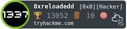

# `$ echo 'Hi there 👋'`

## `$ whoami`
- 📚 Computer Science student at *Faculty of Computer Science of Iași, România*.
- 🖥 Cybersecurity enthusiast and *future* white hat hacker.
- 🌱 I’m currently learning binary exploitation, reverse engineering, cryptography.
- 🤔 I’m looking for a summer internship, preferably on cybersecurity, in Iași or remote.
- 📫 How to reach me: You can email me at reloadedd@protonmail.com

<!-- Platform Badges -->

 <!-- Hack The Box -->
 
 
 <!-- TryHackMe -->
 

## `$ stat reloadedd`

## `$ ls -l personal-projects`

## `$ ls -l faculty-projects`

## `$ ls -l learning`

## `$ cd ../youth && ls -l high-school`

<!--
**reloadedd/reloadedd** is a ✨ _special_ ✨ repository because its `README.md` (this file) appears on your GitHub profile.

Here are some ideas to get you started:

-->
