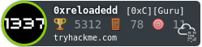

  
  <!-- Platform Badges -->
  

    
    
  

---
### :octocat: ＡＢＯＵＴ ＭＥ
- 🖥 ᴄʏʙᴇʀsᴇᴄᴜʀɪᴛʏ ᴇɴᴛʜᴜsɪᴀsᴛ ᴀɴᴅ ғᴜᴛᴜʀᴇ ᴡʜɪᴛᴇ ʜᴀᴛ ʜᴀᴄᴋᴇʀ.
- 🌱 ɪ’ᴍ ᴄᴜʀʀᴇɴᴛʟʏ ʟᴇᴀʀɴɪɴɢ ʙɪɴᴀʀʏ ᴇxᴘʟᴏɪᴛᴀᴛɪᴏɴ ᴀɴᴅ ʀᴜsᴛ.
- 📞 ᴄᴏɴᴛᴀᴄᴛ: ʏᴏᴜ'ʟʟ ғɪɴᴅ ᴀ ᴡᴀʏ.
-  ʙᴛᴡ ɪ ᴜsᴇ ᴀʀᴄʜ

---
### :hammer_and_wrench: ＬＡＮＧＵＡＧＥＳ ＡＮＤ ＴＯＯＬＳ
&nbsp;
&nbsp;
&nbsp;
&nbsp;
&nbsp;
&nbsp;
&nbsp;
&nbsp;
&nbsp;

---
### :bar_chart: ＳＴＡＴＩＳＴＩＣＳ

---
### :books: ＦＥＡＴＵＲＥＤ ＰＲＯＪＥＣＴＳ
- **ɢᴜɪ ʜᴛᴛᴘ sɴɪғғᴇʀ**
  - :scroll: ɢʜs ɪ.ᴇ. ɢᴜɪ ʜᴛᴛᴘ sɴɪғғᴇʀ, ɪs ᴀ ʟᴀʏᴇʀ-𝟽 sɴɪғғᴇʀ, ᴛᴀʀɢᴇᴛɪɴɢ ᴜɴᴇɴᴄʀʏᴘᴛᴇᴅ ʜᴛᴛᴘ ᴛʀᴀғғɪᴄ ᴀɴᴅ ɪs ᴄᴀᴘᴀʙʟᴇ ᴏғ ʀᴇᴀᴅɪɴɢ ᴀɴᴅ ᴀɴᴀʟʏᴢɪɴɢ ᴛʜᴀᴛ ᴛʀᴀғғɪᴄ.
  - :paperclip: [ʀᴇʟᴏᴀᴅᴇᴅᴅ/ɢᴜɪ-ʜᴛᴛᴘ-sɴɪғғᴇʀ](https://github.com/reloadedd/gui-http-sniffer)
- **ᴍʏssʜ**
  - 📜 ᴍʏssʜ ɪs ᴀ sɪᴍᴘʟᴇ ɪᴍᴘʟᴇᴍᴇɴᴛᴀᴛɪᴏɴ ᴏғ ᴛʜᴇ ssʜ ᴘʀᴏɢʀᴀᴍ ᴀɴᴅ ʜᴀs ᴛʜᴇ ᴀʙɪʟɪᴛʏ ᴛᴏ ʜᴀɴᴅʟᴇ ᴘsᴇᴜᴅᴏ-ᴛᴇʀᴍɪɴᴀʟs ᴏᴠᴇʀ ɴᴇᴛᴡᴏʀᴋ ᴀɴᴅ ᴇɴᴄʀʏᴘᴛ ɪᴛs ᴛʀᴀғғɪᴄ. ɪᴛ ᴀʟsᴏ ʜᴀs ᴀɴ ᴏᴘᴛɪᴏɴᴀʟ ғᴇᴀᴛᴜʀᴇ ᴛᴏ ᴜsᴇ ᴀɴ ᴏɴᴇ-ᴛɪᴍᴇ-ᴘᴀssᴡᴏʀᴅ (ᴏᴛᴘ) ғᴏʀ ᴄᴏɴɴᴇᴄᴛɪɴɢ ᴛᴏ ᴛʜᴇ sᴇʀᴠᴇʀ. ɪᴛ ɪs ᴄᴏᴍᴘᴏsᴇᴅ ᴏғ ᴛᴡᴏ ᴄᴏᴍᴘᴏɴᴇɴᴛs: ᴛʜᴇ ᴄʟɪᴇɴᴛ ᴀɴᴅ ᴛʜᴇ sᴇʀᴠᴇʀ. ᴛʜᴇ sᴇʀᴠᴇʀ ɪs ᴄᴏɴᴄᴜʀʀᴇɴᴛ ᴀɴᴅ ᴀᴄᴄᴇᴘᴛs ᴍᴜʟᴛɪᴘʟᴇ ʀᴇᴍᴏᴛᴇ ᴄʟɪᴇɴᴛs ғᴏʀ ᴡʜɪᴄʜ ɪᴛ ᴀʟʟᴏᴄᴀᴛᴇs ᴀ ᴘsᴇᴜᴅᴏᴛᴇʀᴍɪɴᴀʟ ᴀɴᴅ ᴇɴᴄʀʏᴘᴛs ᴛʜᴇɪʀ ᴄᴏᴍᴍᴜɴɪᴄᴀᴛɪᴏɴs.
  - 📎 [ʀᴇʟᴏᴀᴅᴇᴅᴅ/ғᴀᴄᴜʟᴛʏ/𝟶x𝟸-ᴛʜᴇ_sᴛʀᴜɢɢʟᴇ/ᴄᴏᴍᴘᴜᴛᴇʀ-ɴᴇᴛᴡᴏʀᴋs/ᴍʏssʜ](https://github.com/reloadedd/Faculty/tree/master/0x2-the_struggle/Computer-Networks/MySSH)
- **ᴢᴇʀᴏ**
  - 📜 ᴢᴇʀᴏ ɪs ᴀɴ ᴏs-ᴀɢɴᴏsᴛɪᴄ ᴄʜᴀᴛ ᴀᴘᴘʟɪᴄᴀᴛɪᴏɴ, ᴘʀɪᴍᴀʀɪʟʏ ᴍᴇᴀɴᴛ ᴛᴏ ʙᴇ ᴜsᴇᴅ ᴏɴ ᴀɴᴅʀᴏɪᴅ, ᴛʜᴀᴛ ᴜsᴇs ᴢᴇʀᴏ-ᴋɴᴏᴡʟᴇᴅɢᴇ ᴇɴᴄʀʏᴘᴛɪᴏɴ ғᴏʀ ᴍᴇssᴀɢᴇ sᴛᴏʀᴀɢᴇ.
  - 📎 [ʀᴇʟᴏᴀᴅᴇᴅᴅ/ᴢᴇʀᴏ](https://github.com/reloadedd/Zero)

---

The resources used for creating this README file can be found inside the <a href="https://github.com/reloadedd/reloadedd/blob/master/RESOURCES.md">RESOURCES.md</a> file.

